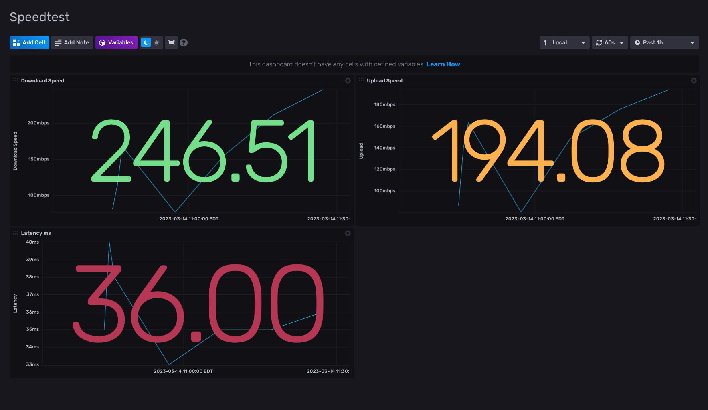

# SpeedTest

This is an application stack to monitor the your Internet speeds using InfluxDB. The application is written in go using [this](https://github.com/showwin/speedtest-go) speedtest project. The code is simple by nature allowing beginners to understand and hopefully alter the code enough to meet their needs.

## Getting Started

This uses Docker, although, not absolutely required, highly recommended. This solution will build to separate containers, a golang app container which runs the speedtests and publishes the results to the InfluxDB, and the InfluxDB. There is a `docker-compose.yml` file included, which can be used to standup the entire environment, once ready.

### Environment Variables

There are a number of environment variables required to get this up and running. The `sample.env` file can be used as a reference. Here are the values which must be provided in a .env file - it is suggested to update these values.

```yaml
INFLUXDB_USERNAME=admin # username for influxdb
INFLUXDB_PASSWORD=admin1234 # password for influxdb
INFLUXDB_TOKEN=yEoCmBGDmHh58faG7rc-Xh1GOiuSYAAAGEKRK0a_w6tskI1ul7Zl4MaFpWbwe0rEhpwxctQ_qi5zbE-7CkdA8w== # influxDB token - this is configured when first setting up influxdb - can be changed later
INFLUXDB="http://influxdb:8086" # hostname for the influxDB container or server
INFLUXDB_ORG="homelab" # the name of the influxdb org
INFLUXDB_BUCKET="speedtest" # the name of the influxdb bucket
IMAGE_TAG=latest # docker hub image tag
CHECK_INTERVAL=10 # how many minutes between checks
```

### Docker Compose

The docker compose file contains a single volume for the influxDB data.

The speedtest service uses the `tpeterson66/speedtest` image with the required environment variables. This is dependent on the influxDB being online and healthy before starting.

The InfluxDB service does the initial configuration of the database and will create the bucket to store the data. The speedtest application will setup the key-value pairs in the new bucket.

The influxdb service is exposed on port 8086 which is accessible to create dashboards or query the data in the DB.

Run `docker-compose up -d` to start both the application and the database once the .env file is created and updated.

## Dashboard

The `dashboard.json` file contains a simple dashboard with cells for the data being collected within the database. Navigate to `http://<Ip of database>:8086` and login with the values provided in the .env file. Navigate to Dashboards and click the Create Dashboard button and choose Import Dashboard. Drag and drop the dashboard.json file OR copy and paste the contents. Here is a sample of the dashboard based on the parameters of my Internet connection.



The dashboard cells are configurable using the gear icon on each cell. The thresholds and colors can be updated to match your Internet connection indicating highs and lows easily.

---
This should not be treated as production worthy. This is a simply DIY project that should only be used for home use unless the code and implementation has been reviewed and updated to match production standards.
